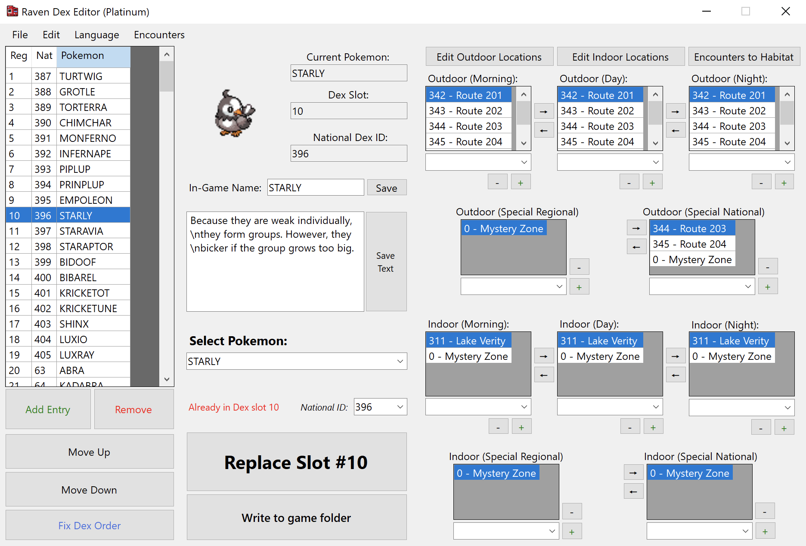

# Raven Dex Editor

A tool to edit regional pokedex order, area data, names and descriptions in Gen 4-5 games

## Features:
* <b>DP/Pt/HG/SS</b> support
* <b>BW/BW2</b> support
* <b>hg-engine</b> support (experimental)
* Add, Remove, Edit Pokédex entries
* Edit Pokemon Habitat/Area data
* Import/Export entire Dex as .txt
* Export all .bin files already formatted
* Write everything to <a href=https://github.com/AdAstra-LD/DS-Pokemon-Rom-Editor>DSPRE</a> folder, or insert with [Tinke](https://github.com/pleonex/tinke)

## Notes
* In order to use the new features in HG/SS, you have to uncompress overlay 18 using [DSPRE’s latest beta](https://github.com/Mixone-FinallyHere/DS-Pokemon-Rom-Editor/releases/latest)

## Credits
Parts of the NARC unpacking/repacking functions are based on <b><a href="https://github.com/AdAstra-LD/DS-Pokemon-Rom-Editor/blob/main/DS_Map/Narc.cs">DSPRE</a></b> by <b><a href="https://github.com/AdAstra-LD">AdAstra</a></b> and <b><a href="https://github.com/Nomura-RH">Nomura</a></b>

Special Thanks to <b>@RefinedPlatinum</b> for the help and extensive testing!

<b>Xehnog</b>, a user from <i>Kingdom of DS Hacking</i> who first investigated the BW2 Habitat List and its structure

<b>Domeko</b>, a user from <i>Kingdom of DS Hacking</i> whose edits helped me match the different file names with corresponding locations

