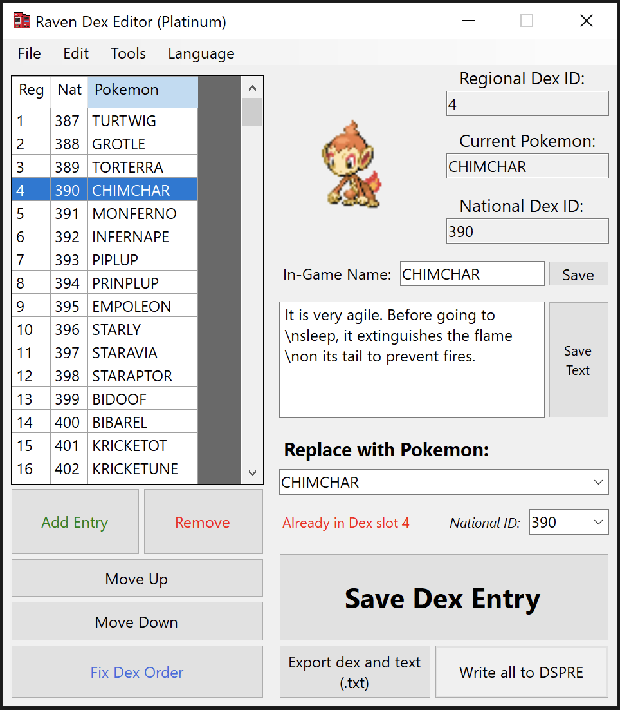

# Raven Dex Editor

A tool to edit regional pokedex order, names and descriptions in Gen 4-5 games

## Classic Mode features:
* DP/Pt/HG/SS support
* BW/BW2 support
* Add, Remove, Edit & Move entries
* Language-specific naming (English, French, and German)
* Import/Export entire Dex as .txt
* Export all .bin files already formatted, ready to insert

You'll need **[Tinke](https://github.com/pleonex/tinke)** or something similar to insert the generated files

## <a href=https://github.com/AdAstra-LD/DS-Pokemon-Rom-Editor>DSPRE</a> Mode features:
* Edit names and descriptions
* Same functionalities as 'Classic Mode'
* Write everything to DSPRE folder, no need for [Tinke](https://github.com/pleonex/tinke)

## Notes
* The language toggle does not change how the names are displayed in game, only in the tool

