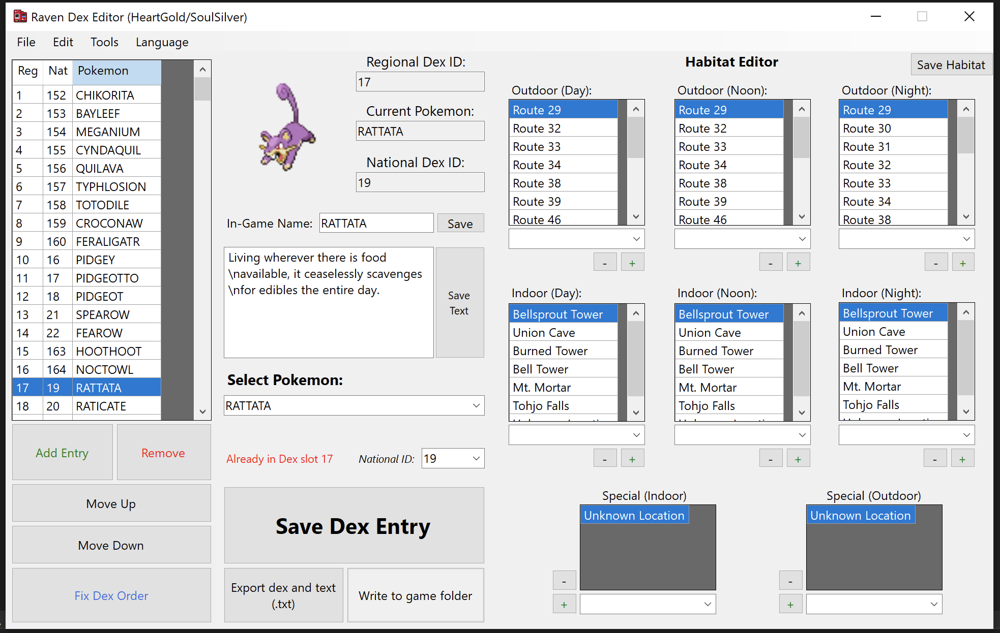

# Raven Dex Editor

A tool to edit regional pokedex order, area data, names and descriptions in Gen 4-5 games

## Classic Mode features:
* DP/Pt/HG/SS support
* BW/BW2 support
* Add, Remove, Edit & Move entries
* Edit Pokemon Habitat/Area data (BW/BW2 only)
* Language-specific naming (English, French, and German)
* Import/Export entire Dex as .txt
* Export all .bin files already formatted, ready to insert

You'll need **[Tinke](https://github.com/pleonex/tinke)** or something similar to insert the generated files

## Folder Mode features:
* Edit Names and descriptions
* Edit <b>Area Data</b> (Gen 4)
* Same functionalities as 'Classic Mode'
* Write everything to <a href=https://github.com/AdAstra-LD/DS-Pokemon-Rom-Editor>DSPRE</a> folder, no need for [Tinke](https://github.com/pleonex/tinke)

## Notes
* The language toggle does not change how the names are displayed in game, only in the tool

## Credits
<a href="https://github.com/nickworonekin">nickworonekin</a> for <a href="https://github.com/nickworonekin/narchive">narchive</a>, a narc unpacker/repacker tool

<a href="https://github.com/PikalaxALT">PikalaxALT</a> for <a href="https://github.com/pret/pokeheartgold/tree/master/tools/msgenc">msgenc</a>, a text archive encoding tool

