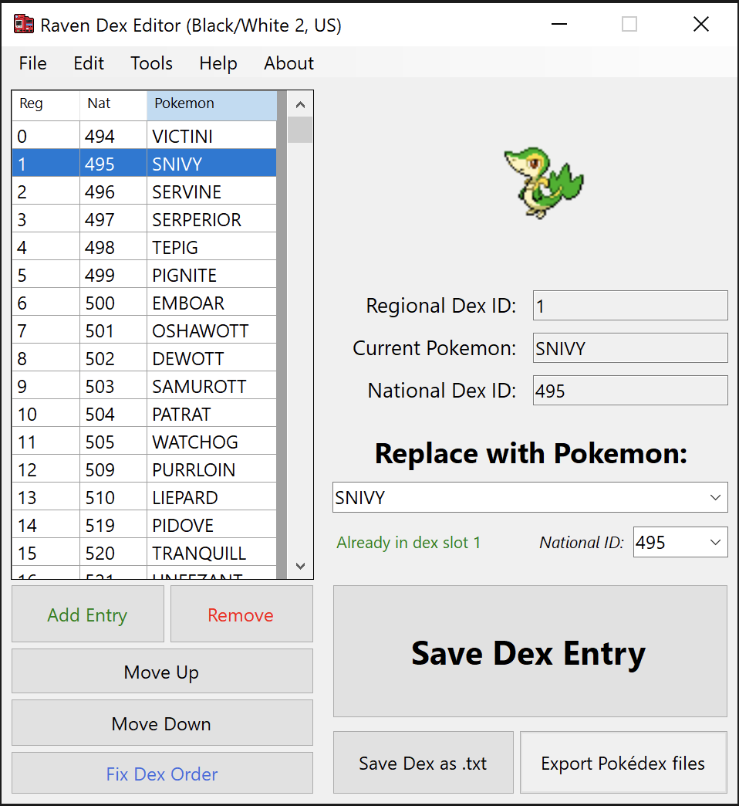

# Raven Dex Editor

A tool to edit regional pokedex order in Gen 4-5 games

## Features:
* DP/Pt/HG/SS support
* BW/BW2 support (still experimental)
* Add, Remove, Edit & Move entries
* Language-specific naming (English, French, and German)
* Import/Export entire Dex as .txt
* Export all .bin files already formatted, ready to insert

You'll need **[Tinke](https://github.com/pleonex/tinke)** or something similar to insert the generated files

